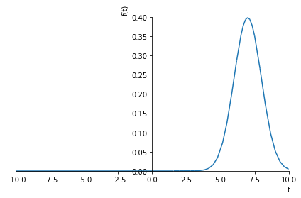
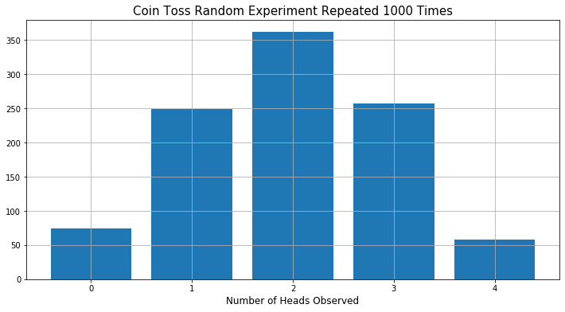
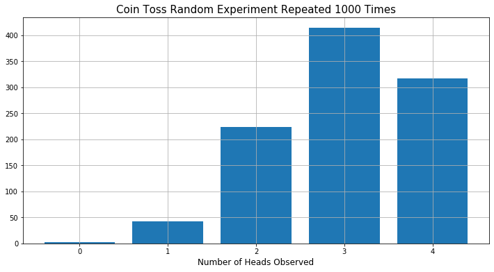

## Problems

### Key:

- __(w)__ indicates a __word__ problem
- __(f)__ indicates a __formula__ problem
- __(c)__ indicates a __computer__ problem
- __(t)__ indicates a __theoretical__ problem
- 😃 indicates the answer is available in the back

## Imports


```python
import numpy as np
import matplotlib.pyplot as plt
import sympy as sm
sm.init_printing(use_latex='mathjax')

%matplotlib inline
# %matplotlib notebook is another option for interactive graphs

from IPython.core.display import HTML # Code to center plots in the screen
HTML("""
<style>
.output_png {
    display: table-cell;
    text-align: center;
    vertical-align: middle;
}
</style>
""")
```


<style>
.output_png {
    display: table-cell;
    text-align: center;
    vertical-align: middle;
}
</style>


***
### 1.1 😃 (w)
A fair coin is tossed. Identify the random experiment, the set of outcomes, and the probabilities of each possible outcome.

#### Answer
- The random experiment is tossing the coin once.
- The set of outcomes is: $\{H,T\}$
- The probabilities of each possible outcome are: $\frac{1}{2}, \frac{1}{2}$

***
### 1.2 (w)
A card is chosen at random from a deck of $52$ cards. Identify the random experiment, the set of outcomes, and the probabilities of each possible outcome.

#### Answer
- The random experiment is choosing one card randomly from the deck. 
- The set of outcomes is:
$\{(\text{❤️},A), \dots, (\text{❤️},1), 
(\text{♠️}, A), \dots, (\text{♠️},1), 
(\text{♣️}, A), \dots, (\text{♣️},1), 
(\text{♦️}, A), \dots, (\text{♦️},1)\}$ (emojis found [here](https://emojipedia.org/small-orange-diamond/))
- The probabilities of each possible outcome are: $\frac{1}{52},\dots, \frac{1}{52}$

***
### 1.3 (w)
A fair die is tossed and the number of dots on the face noted. Identify the random experiment, the set of outcomes, and the probabilities of each possible outcome.

#### Answer
- The random experiment is rolling the die once.
- The set of outcomes is: $\{1,2,3,4,5,6\}$
- The probabilities of each possible outcome are: $\frac{1}{6},\dots, \frac{1}{6}$

***
### 1.4 (w)
It is desired to predict the annual summer rainfall in Rhode Island for 2010. If we use $9.76$ inches as our prediction, how much in error might we be, based on the past data shown in Figure 1.1? Repeat the problem for Arizona by using $4.40$ inches as the prediction.

#### Answer
- Rhode Island
   - The farthest (not the standard) deviation from the average is $\approx 7.25$ inches so at worst $75\%$ error
- Arizona
   - The farthest (not the standard) deviation from the average is $\approx 4.4$ inches so at worst $100\%$ error

***
### 1.5 😃 (w)
Determine whether the following experiments have discrete or continuous outcomes:
1. Throw a dart with a point tip at a dartboard
2. Toss a die
3. Choose a lottery number
4. Observe the outdoor temperature using an analog thermometer
5. Determine the current time in hours, minutes, seconds, and AM or PM

#### Answer
1. Continuous
2. Discrete
3. Discrete
4. Continuous
5. Discrete

***
### 1.6 (w)
An experiment has $N=10$ outcomes that are equally probable. What is the probability of each outcome? Now let $N=1000$ and also $N=1,000,000$ and repeat. What happens as $N \rightarrow \infty$?

#### Answer
- $N=10$:
    -  The probability of each outcome is $\frac{1}{10}= 0.1$
    
    
- $N=1000$: 
    - The probability of each outcome is $\frac{1}{1000}=0.001$
    
    
- $N=1,000,000$: 
    - The probability of each outcome is $\frac{1}{1,000,000}=0.000001$
    
    
- $N\rightarrow \infty$: 
    - The probability of each outcome is $\lim_{n \rightarrow \infty} { \frac{1}{n} } = 0$

***
### 1.7 😃 (f)
Consider an experiment with possible outcomes $\{1,2,3,\dots\}$. If we assign probabilities

$$
P[k] = \frac{1}{2^k}, \text{ for }  k=1,2,3\dots
$$

to the outcomes, will these probabilities sum to one? Can you have an infinite number of outcomes but still assign nonzero probabilities to each outcome? Reconcile these results with that of Problem 1.6.

#### Answer
We begin with an infinte sum
$$
\sum_{i=1}^{\infty}{P[i]} = \sum_{i=1}^{\infty}{\big(\frac{1}{2} \big)^i}
$$

This is an instance of a real geometric series with $k=1$: Let $x\in\mathbb{R}: |x|<1$

$$
\sum_{i=k}^{\infty}{x^i} = \frac{x^k}{1 - x}
$$

So for our problem 

$$\begin{equation}
    \begin{split}
        \sum_{i=1}^{\infty}{\big(\frac{1}{2} \big)^i} &= \frac{x}{1-x} \\
        &= \frac{\frac{1}{2}}{1 - \frac{1}{2}} \\
        &= 1.
    \end{split}
\end{equation}$$

Even though there is an infinite set of outcomes, the probabilities assigned to each are nonzero and still sum to $1$ in the limit. At the end of Problem 1.6 we saw the opposite behavior (under different conditions): an infinite set of _equiprobable_ outcomes weights each individual outcome with zero probability.

***
### 1.8 (w)
An experiment consists of tossing a fair coin four times in succession. What are the possible outcomes? Now count up the number of outcomes with three heads. If the outcomes are equally probable, what is the probability of three heads? Compare your results to that obtained using equation (1.1)

$$
\begin{equation}
    P[k] =  {N \choose k} p^k(1-p)^{N-k}
\end{equation}
$$

where

$$
\begin{equation}
    {N \choose k} = \frac{N!}{(N-k)!k!}
\end{equation}
$$

#### Answer

The possible outcomes $\{x_1,x_2,x_3,x_4\}$ are:

$\{H,H,H,H\}$, $\{T,H,H,H\}$, $\{H,T,H,H\}$, $\{H,H,T,H\}$, $\{H,H,H,T\}$, $\{T,T,H,H\}$, $\{H,T,T,H\}$, $\{H,H,T,T\}$, $\{T,H,T,H\}$, $\{H,T,H,T\}$, $\{T,H,H,T\}$, $\{T,T,T,H\}$, $\{H,T,T,T\}$, $\{T,T,H,T\}$, $\{T,H,T,T\}$, $\{T,T,T,T\}$

We can also use Python to find the possible outcomes using a list comprehension to enumerate the $2^4$ options.


```python
# Get unique combinations 
outcomes = [(i,j,k,l) for i in (0,1) for j in (0,1) for k in (0,1) for l in (0,1)]
outcomes
```


$\displaystyle \left[ \left( 0, \  0, \  0, \  0\right), \  \left( 0, \  0, \  0, \  1\right), \  \left( 0, \  0, \  1, \  0\right), \  \left( 0, \  0, \  1, \  1\right), \  \left( 0, \  1, \  0, \  0\right), \  \left( 0, \  1, \  0, \  1\right), \  \left( 0, \  1, \  1, \  0\right), \  \left( 0, \  1, \  1, \  1\right), \  \left( 1, \  0, \  0, \  0\right), \  \left( 1, \  0, \  0, \  1\right), \  \left( 1, \  0, \  1, \  0\right), \  \left( 1, \  0, \  1, \  1\right), \  \left( 1, \  1, \  0, \  0\right), \  \left( 1, \  1, \  0, \  1\right), \  \left( 1, \  1, \  1, \  0\right), \  \left( 1, \  1, \  1, \  1\right)\right]$


```python
# Sum each element of the outcomes to find number of heads
count = np.array([sum(i) for i in outcomes])
print(count)

# Count up the number of outcomes with three heads and divide by the length of all the outcomes
prob = len(count[count == 3]) / len(count)
prob
```

    [0 1 1 2 1 2 2 3 1 2 2 3 2 3 3 4]
    


$\displaystyle 0.25$


Using equation (1.1), we can solve the problem through analytical means. Let $N=4, k=3,$ and $ p=\frac{1}{2}$, then
    
$$\begin{equation}
    \begin{split}
        P[3] &= {4 \choose 3} \big(\frac{1}{2} \big)^3 \big(1-\frac{1}{2} \big)^{4-3} \\
        \\
        &= \frac{4!}{(4-3)!3!}\big(\frac{1}{8} \big)\big(\frac{1}{2}\big) \\
        \\
        &= \frac{1}{4}
    \end{split}
\end{equation}
$$

***
### 1.9 (w)
Perform the following experiment by _actually tossing_ a coin of your choice. Flip the coin four times and observe the number of heads. Then, repeat this experiment $10$ times. Using (1.1) determine the probability for $k=0,1,2,3,4$ heads. Next, use (1.1) to determine the number of heads that is most probable for a single experiment. In your $10$ experiments which number of heads appeared most often?

#### Answer

Trial:              | 1    | 2    | 3    | 4    | 5    | 6    | 7    | 8    | 9    | 10
--------------------|------|------|------|------|------|------|------|------|------|------
__Result:__         | HHTH | HTHT | TTTT | TTHH | THTH | HHHT | HTTH | HTHT | HHHT | HTHT
__Number of Heads__ | 3    | 2    | 0    | 2    | 2    | 3    | 2    | 2    | 3    | 2


k:   | 0    | 1    | 2    | 3    | 4
-----|------|------|------|------|------
P[k] |$\frac{1}{16}$ | $\frac{4}{16}$ | $\frac{6}{16}$ | $\frac{4}{16}$ | $\frac{1}{16}$

In our $10$ experiments $2$ heads appeared most often which agrees with the assumption that we used a fair coin and the fact that $P[2]$ has the highest probability of happening. Notice that the pattern of the numerators follows the coefficients in [Pascal's "triangle"](https://www.wikiwand.com/en/Pascal%27s_triangle) (row 4).


***
### 1.10 😃 (w)
A coin is tossed $12$ times. The sequence observed is the 12-tuple $(H,H,T,H,H,T,H,H,H,H,T,H)$. Is this coin fair? Hint: Determine $P[k=9]$ using (1.1) assuming a probability of heads is $p=\frac{1}{2}$.

#### Answer

Following the hint

$$\begin{equation}
    \begin{split}
    P[9] &= {12 \choose 9} \big(\frac{1}{2} \big)^9 \big(1-\frac{1}{2} \big)^{12-9} \\
    \\
    &= \frac{12!}{(12-9)!9!}\big(\frac{1}{512} \big)\big(\frac{1}{8}\big) \\
    \\
    &= \frac{(12)(11)(10)}{3!}\frac{1}{4096} \\
    \\
    &\approx 0.054
    \end{split}
\end{equation}$$

So there's about a $5.4\%$ chance we'd observe this sequence if the coin is fair. That's pretty low, so it's reasonable to conclude that this coin is _likely_ biased.

***
### 1.11 (t)
Prove that $\sum_{k=0}^{N}{P[k]} = 1$, where $P[k]$ is given by (1.1). Hint: First prove the __binomial theorem__

$$
(a+b)^N = \sum_{k=0}^{N}{N \choose k} a^k b^{N-k}
$$

by induction (see Appendix B). Use Pascal's "triangle" rule

$$
{M \choose k} = {{M-1} \choose k} + {{M-1} \choose {k-1}}
$$

where

$$
{M \choose k} = 0
$$

for $k<0$ and $k>M$.

#### Answer

Let's begin by proving the binomial theorem by induction. First we consider the base case $N = 0$ and show that the $LHS=RHS$:

$$
(a+b)^0 = 1
$$

and

$$
\sum_{k=0}^{0}{0 \choose k} a^k b^{0-k} = {0 \choose 0}(1)(1) = 1.
$$

Now we assume that the formula holds true for an arbitrary $N = n >0$:

$$
(a+b)^n = \sum_{k=0}^{n}{n \choose k} a^k b^{n-k}.
$$

Next we need to show the result hold for $N = n+1$:

$$\begin{align}
% Step1
(a+b)^{n+1} &= (a+b)(a+b)^n\\
\\
% Step2 
&= (a+b)\sum_{k=0}^{n}{n \choose k} a^k b^{n-k} 
\end{align}
$$

$$
% Step3
= (a+b)\bigg(
{n \choose 0}b^n + 
{n \choose 1}ab^{n-1} + 
{n \choose 2}a^2b^{n-2} +
\dots +
{n \choose {n-2}}a^{n-2}b^2 +
{n \choose {n-1}}a^{n-1}b +
{n \choose n}a^{n}
\bigg). 
$$

It's going to get worse before it gets better:

$$
% Step4
(a+b)^{n+1} = A + B
$$ 

where

$$
A = { n \choose 0 }ab^n + 
{ n \choose 1 }a^2b^{n-1} + 
{ n \choose 2 }a^3b^{n-2} +
\dots +
{ n \choose {n-2} }a^{n-1}b^2 +
{ n \choose {n-1} }a^{n}b +
{ n \choose n }a^{n+1}
$$

and

$$
B= { n \choose 0 }b^{n+1} + 
{ n \choose 1 }ab^{n} + 
{ n \choose 2 }a^2b^{n-1} +
\dots +
{ n \choose {n-2} }a^{n-2}b^3 +
{ n \choose {n-1} }a^{n-1}b^2 +
{ n \choose n }a^{n}b 
$$

Now we'll group like terms and use Pascal's "triangle" rule with $M\leftarrow (N+1)$ substituted:

$$
= b^{n+1} + 
\bigg({n \choose 0} + {n \choose 1} \bigg)ab^{n} + 
\bigg({n \choose 1} + {n \choose 2} \bigg)a^2b^{n-1} + 
\dots +
\bigg({n \choose {n-2}} + {n \choose {n-1}}\bigg)a^{n-1}b^2 +
\bigg({n \choose {n-1}} + {n \choose n}\bigg)a^{n}b + 
a^{n+1}
$$

$$
= b^{n+1} + 
{{n+1} \choose 1} ab^{n} + 
{{n+1} \choose 2} a^2b^{n-1} + 
\dots +
{{n+1} \choose {n-1}} a^{n-1}b^2 +
{{n+1} \choose n} a^{n}b + 
a^{n+1}
$$

$$
= \sum_{k=0}^{n+1}{{n+1} \choose k} a^k b^{n+1-k}
$$

Thus, we have shown by induction that the binomial theorem is true.

Now, our job is to use this result to show equation (1.1) sums to one. We begin by noting that equation (1.1) can be found by substituting $a \leftarrow p $ and $b \leftarrow (1-p) $ in the binomial theorem thus:

$$\sum_{k=0}^{N}{N \choose k}p^k(1-p)^{N-k} = (a+b)^N = 1^N = 1.$$

***
### 1.12 (t)
If $P[a \leq T \leq b] = \int_{a}^{b}{p_T(t)dt}$ is the probability of observing $T$ in the interval $[a,b]$, what is $\int_{-\infty}^{\infty}{p_T(t)dt}$?

#### Answer

This is the probability of observing $T$ in the entire probability space and is necessarily guaranteed because _all_ of the area under the curve is accounted for: 

$$\int_{-\infty}^{\infty}{p_T(t)dt} = 1$$

***
### 1.13 😃 (f)
Using (1.2) what is the probability of $T>7$? Hint: Observe that $p_T(t)$ is symmetric about $t=7$. Equation (1.2) defines an instance of the 1-D Gaussian distribution:

$$
p_T(t) = \frac{1}{\sqrt{2\pi}} e^{-\frac{1}{2}(t-7)^2} \text{ for } -\infty < t < \infty
$$

#### Answer

Since we know that $p_T(t)$ is symmetric about $t=7$ we can immediately conclude that __half__ of the total probability lies on either side of $t=7$. To show this analytically we integrate

$$
P(7 < T) = \int_{7}^{\infty} \frac{1}{\sqrt{2\pi}} e^{-\frac{1}{2}(t-7)^2}dt
$$

Let's allow [`sympy`](https://docs.sympy.org/latest/modules/integrals/integrals.html) to do the heavy lifting and calculate the definite integral for us.


```python
# Define the variable
t = sm.symbols('t')

# Define the gaussian probability density function pT(t)
pT = sm.exp(-sm.Rational(1,2)*(t-7)**2) / sm.sqrt(2*sm.pi)

# Symbolically integrate the expression
ans = sm.integrate(pT, (t, 7, sm.oo))
display(ans)

sm.plot(pT)
plt.show()
```


$\displaystyle \frac{1}{2}$


    

    


***
### 1.14 😃 (c)
Evaluate the integral
$$
\int_{-3}^{3}{ \frac{1}{\sqrt{2\pi}} e^{-\frac{1}{2}t^2} dt}
$$
by using the approximation
$$
\sum_{n=-L}^{L}{ \frac{1}{\sqrt{2\pi}} e^{-\frac{1}{2}(n\Delta)^2} \Delta }
$$

where $L$ is the integer closest to $\frac{3}{\Delta}$ (the rounded value), for $\Delta=0.1$, $\Delta=0.01$, $\Delta=0.001$. (Note that there was likely a typo in the above sum in the book: there shouldn't be a $t$ present.)


```python
def g(n, dx):
    '''Gaussian function for numerical integration
    Args:
        n (int): integer along x-axis in [-3,3]
        dx (int): partition size
        
    Returns:
        (float): Approx value of Gaussian curve with given parameters
    '''
    return sm.exp(-0.5*(n*dx)**2) / sm.sqrt(2*np.pi)
```


```python
dx = 0.001                 # partition size
L = int(np.round(3 / dx))  # Bounds of the sum
ns = np.arange(-L, L+1)    # integers along x-axis in [-L,L]

result = []
for n in ns:            # Loop over all integers in [-L,L]
    calc = g(n, dx)*dx  # Calculations for a particular n
    result.append(calc) # Store the value

sum(result)
```


$\displaystyle 0.997304633569231$


***
### 1.15 (c)
Simulate a _fair_ coin tossing experiment by modifying the code given in Section 1.4. Using `1000` repetitions of the experiment, count the number of times three heads occur. What is the simulated probability of obtaining three head in four coin tosses? Compare your result to that obtained using (1.1).
```matlab
number = 0;
for i=1:4 % set up simulation for 4 coin tosses
    if rand(1,1) < 0.75 % toss coin with p=0.75
        x(i,1) = 1; % head
    else
        x(i,1) = 0; % tail
    end
number = number + x(i,1); % count number of heads
end
```

The __relative frequency__ interpretation of the probability of observing three heads given $N$ repetitions of the experiment is given by


$$
P[\text{3 heads}] = \frac{\text{Number of times 3 heads observed}}{N}
$$


```python
def coinToss(k, p):
    '''The coin toss random experiment
    
    Args:
        k (int > 0): number of coin tosses to consider for the experiment
        p (float): Probability of heads where p in [0,1]. A fair coin has p=0.5
        
    Returns:
        count (int): number of heads observed during the experiment
    '''
    count = 0 # The count of heads so far
    x = np.empty((1,k)) # a 1xk array of outcomes of each toss
    
    for i in range(1, k+1): # set up simulation for k coin tosses
        if np.random.random(1) < p: # toss coin with probability of heads p
            x[:, i-1] = 1 # heads        
        else:
            x[:, i-1] = 0 # tails
        count += x[:, i-1]
        
    return int(count[0])
```


```python
def runCoinExperiment(N, k=4, p=0.5):
    '''
    Args:
        N (int): Number of trials of the experiment
        k (int > 0): number of coin tosses to consider for the experiment
        p (float): Probability of heads where p in [0,1]. A fair coin has p=0.5
        
    Returns:
        probs (array): the probability vector of each outcome
        outcomes (dict): the outcomes of the trials by frequency
    '''
    # Initialize the set of outcomes and set the count at 0
    outcomes = {heads:0 for heads in range(k+1)}

    # Repeat the experiment N times
    for n in range(N):
        i = coinToss(k, p) # Call the experiment
        outcomes[i] += 1   # increment the count of seeing i heads

    probs = np.asarray([*outcomes.values()]) / N

    return probs, outcomes
```


```python
N = 1000 # Number of times to repeat the experiment
k = 4    # Number of coin tosses in one instance of the experiment

probs, outcomes = runCoinExperiment(N, k)

print(outcomes)
print('\nThe probability of observing {:} Heads is approximately:\n{:} percent'.format([*outcomes.keys()], probs*100))
```

    {0: 74, 1: 249, 2: 362, 3: 257, 4: 58}
    
    The probability of observing [0, 1, 2, 3, 4] Heads is approximately:
    [ 7.4 24.9 36.2 25.7  5.8] percent
    


```python
fig, ax = plt.subplots(figsize=(12,6))

plt.bar(x=[*outcomes.keys()], height=[*outcomes.values()])

# Set labels, grid, and show plot
plt.title('Coin Toss Random Experiment Repeated 1000 Times', fontsize=15)
plt.xlabel('Number of Heads Observed', fontsize=12)
plt.grid(True)
plt.show()
```


    

    


***
### 1.16 (c)
Repeat Problem 1.15 but instead consider a biased coin with $p=0.75$. Compare your result to Figure 1.4.


```python
p = 0.75

prob, outcomes = runCoinExperiment(N, k, p)

print(outcomes)
print('The probability of observing 3 Heads is: ', prob)
```

    {0: 3, 1: 42, 2: 224, 3: 414, 4: 317}
    The probability of observing 3 Heads is:  [0.003 0.042 0.224 0.414 0.317]
    


```python
fig, ax = plt.subplots(figsize=(12,6))

plt.bar(x=[*outcomes.keys()], height=[*outcomes.values()])

# Set labels, grid, and show plot
plt.title('Coin Toss Random Experiment Repeated 1000 Times', fontsize=15)
plt.xlabel('Number of Heads Observed', fontsize=12)
plt.grid(True)
plt.show()
```


    

    


```python

```
